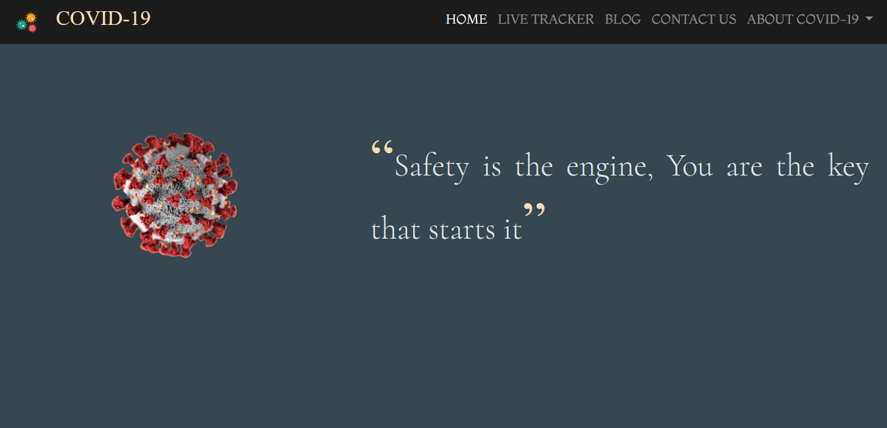
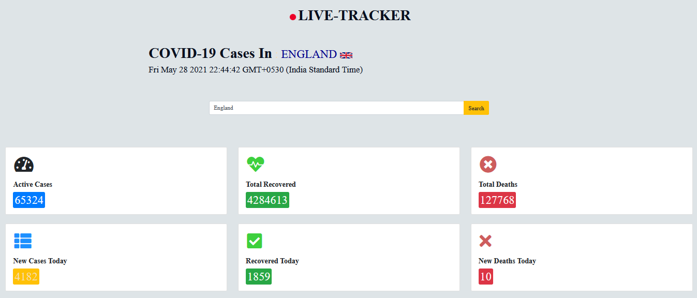
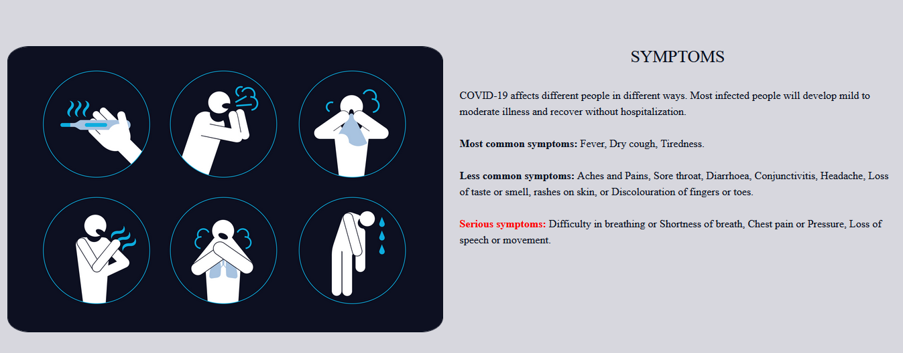
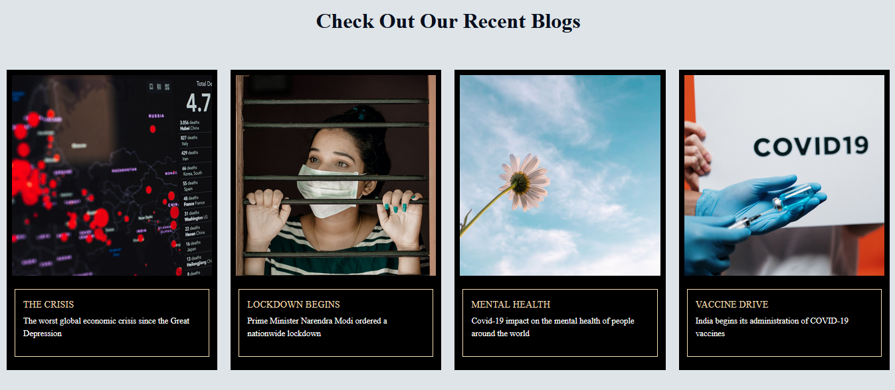

### 
<h1 align="center" > COVID-19 DASHBOARD </h1>
 

Currently the entire world is experiencing the desolation and devastation of a deadly virus, the new disease of COVID-19, emerging from the new coronavirus SARS-CoV 2, has spread throughout the world, affecting more than 200 countries and millions of people, with discouraging morbidity and mortality
figures.

With all this in view, we came up with an idea to make a <strong>COVID-19 DASHBOARD</strong>. 
 
 

## Salient Features

-> The webpage includes a COVID-19 Live Tracker which displays statistics that is fetched from an Application Programming Interface(API) and gets updated in real time.

-> It also includes basic necessary information like, what is COVID-19, its symptoms and its preventions, that the people must be made aware of.

-> It contains some blogs which update you about what is happening across the globe, the crisis that has been faced, the mental health of the people, the vaccine drive in India, what are the consequences of this deadly virus and how it has affected the economic status of the whole world.

-> At the end, we have included a 'DONATE' button which redirects you to the <strong>PM CARES Fund</strong>, where you can donate and help India tackle this detestable situation.
 
 

## Screenshots

 

  

    <a href="https://github.com/arjunn21/COVID-19-DASHBOARD/issues">Report a Bug</a>
    ·
    <a href="https://github.com/arjunn21/COVID-19-DASHBOARD/issues">Request Feature</a>
  

